## Part 1. Запуск нескольких Docker-контейнеров с использованием Docker Compose

- Создадим в папке каждого сервиса `Dockerfile` и `.dockerignore` для `multi-stage` сборки

Пример `Dockerfile` для `gateway-service` (для других аналогично, но меняем порт):
```shell
FROM eclipse-temurin:8-jdk AS builder

WORKDIR /app
COPY pom.xml mvnw ./
COPY .mvn/wrapper/ .mvn/wrapper/

RUN chmod +x mvnw
RUN ./mvnw dependency:go-offline -B
COPY src ./src
RUN ./mvnw clean package -DskipTests

FROM eclipse-temurin:8-jre
RUN groupadd -r appuser && useradd -r -g appuser appuser
WORKDIR /app
COPY --from=builder --chown=appuser:appuser /app/target/*.jar app.jar
COPY --chown=appuser:appuser wait-for-it.sh .
RUN chmod +x wait-for-it.sh

USER appuser
EXPOSE 8087

CMD ["./wait-for-it.sh", "postgres:5432", "--", "java", "-jar", "app.jar"]
```

- Напишем `docker-compose.yaml` с учётом очерёдности запуска всех сервисов
```shell
version: "3.8"

x-common: &common
  restart: unless-stopped
  networks:
    - app-network

services:
  postgres:
    <<: *common
    build:
      context: ./database
      dockerfile: Dockerfile
    image: vazhna/services-postgres:1.0.0
    volumes:
      - postgres-data:/var/lib/postgresql/data
    environment:
      POSTGRES_USER: ${POSTGRES_USER}
      POSTGRES_PASSWORD: ${POSTGRES_PASSWORD}
    healthcheck:
      test: [ "CMD-SHELL", "pg_isready -U ${POSTGRES_USER} -d users_db" ]
      interval: 5s
      timeout: 5s
      retries: 5

  rabbitmq:
    <<: *common
    image: rabbitmq:3-management-alpine
    ports:
      - "15672:15672"
    environment:
      RABBIT_MQ_USER: ${RABBIT_MQ_USER}
      RABBIT_MQ_PASSWORD: ${RABBIT_MQ_PASSWORD}
    healthcheck:
      test: [ "CMD", "rabbitmq-diagnostics", "check_running" ]
      interval: 5s
      timeout: 5s
      retries: 5

  nginx-proxy:
    <<: *common
    image: nginx:stable-alpine
    ports:
      - "80:80"
    volumes:
      - ./nginx/nginx.conf:/etc/nginx/conf.d/default.conf
    depends_on:
      gateway-service:
        condition: service_started

  session-service:
    <<: *common
    build:
      context: ./session-service
      dockerfile: Dockerfile
    image: vazhna/services-session-service:1.0.0
    ports:
      - "8081:8081"
    environment:
      POSTGRES_HOST: ${POSTGRES_HOST}
      POSTGRES_PORT: ${POSTGRES_PORT}
      POSTGRES_USER: ${POSTGRES_USER}
      POSTGRES_PASSWORD: ${POSTGRES_PASSWORD}
      POSTGRES_DB: users_db
    depends_on:
      postgres:
        condition: service_healthy

  hotel-service:
    <<: *common
    build:
      context: ./hotel-service
      dockerfile: Dockerfile
    image: vazhna/services-hotel-service:1.0.0
    environment:
      POSTGRES_HOST: ${POSTGRES_HOST}
      POSTGRES_PORT: ${POSTGRES_PORT}
      POSTGRES_USER: ${POSTGRES_USER}
      POSTGRES_PASSWORD: ${POSTGRES_PASSWORD}
      POSTGRES_DB: hotels_db
    depends_on:
      postgres:
        condition: service_healthy

  payment-service:
    <<: *common
    build:
      context: ./payment-service
      dockerfile: Dockerfile
    image: vazhna/services-payment-service:1.0.0
    environment:
      POSTGRES_HOST: ${POSTGRES_HOST}
      POSTGRES_PORT: ${POSTGRES_PORT}
      POSTGRES_USER: ${POSTGRES_USER}
      POSTGRES_PASSWORD: ${POSTGRES_PASSWORD}
      POSTGRES_DB: payments_db
    depends_on:
      postgres:
        condition: service_healthy

  loyalty-service:
    <<: *common
    build:
      context: ./loyalty-service
      dockerfile: Dockerfile
    image: vazhna/services-loyalty-service:1.0.0
    environment:
      POSTGRES_HOST: ${POSTGRES_HOST}
      POSTGRES_PORT: ${POSTGRES_PORT}
      POSTGRES_USER: ${POSTGRES_USER}
      POSTGRES_PASSWORD: ${POSTGRES_PASSWORD}
      POSTGRES_DB: balances_db
    depends_on:
      postgres:
        condition: service_healthy

  report-service:
    <<: *common
    build:
      context: ./report-service
      dockerfile: Dockerfile
    image: vazhna/services-report-service:1.0.0
    environment:
      POSTGRES_HOST: ${POSTGRES_HOST}
      POSTGRES_PORT: ${POSTGRES_PORT}
      POSTGRES_USER: ${POSTGRES_USER}
      POSTGRES_PASSWORD: ${POSTGRES_PASSWORD}
      POSTGRES_DB: statistics_db
      RABBIT_MQ_HOST: ${RABBIT_MQ_HOST}
      RABBIT_MQ_PORT: ${RABBIT_MQ_PORT}
      RABBIT_MQ_USER: ${RABBIT_MQ_USER}
      RABBIT_MQ_PASSWORD: ${RABBIT_MQ_PASSWORD}
      RABBIT_MQ_QUEUE_NAME: ${RABBIT_MQ_QUEUE_NAME}
      RABBIT_MQ_EXCHANGE: ${RABBIT_MQ_EXCHANGE}
    depends_on:
      postgres:
        condition: service_healthy
      rabbitmq:
        condition: service_healthy

  booking-service:
    <<: *common
    build:
      context: ./booking-service
      dockerfile: Dockerfile
    image: vazhna/services-booking-service:1.0.0
    environment:
      POSTGRES_HOST: ${POSTGRES_HOST}
      POSTGRES_PORT: ${POSTGRES_PORT}
      POSTGRES_USER: ${POSTGRES_USER}
      POSTGRES_PASSWORD: ${POSTGRES_PASSWORD}
      POSTGRES_DB: reservations_db
      RABBIT_MQ_HOST: ${RABBIT_MQ_HOST}
      RABBIT_MQ_PORT: ${RABBIT_MQ_PORT}
      RABBIT_MQ_USER: ${RABBIT_MQ_USER}
      RABBIT_MQ_PASSWORD: ${RABBIT_MQ_PASSWORD}
      RABBIT_MQ_QUEUE_NAME: ${RABBIT_MQ_QUEUE_NAME}
      RABBIT_MQ_EXCHANGE: ${RABBIT_MQ_EXCHANGE}
      HOTEL_SERVICE_HOST: ${HOTEL_SERVICE_HOST}
      HOTEL_SERVICE_PORT: ${HOTEL_SERVICE_PORT}
      PAYMENT_SERVICE_HOST: ${PAYMENT_SERVICE_HOST}
      PAYMENT_SERVICE_PORT: ${PAYMENT_SERVICE_PORT}
      LOYALTY_SERVICE_HOST: ${LOYALTY_SERVICE_HOST}
      LOYALTY_SERVICE_PORT: ${LOYALTY_SERVICE_PORT}
    depends_on:
      postgres:
        condition: service_healthy
      rabbitmq:
        condition: service_healthy
      hotel-service:
        condition: service_started
      payment-service:
        condition: service_started
      loyalty-service:
        condition: service_started

  gateway-service:
    <<: *common
    build:
      context: ./gateway-service
      dockerfile: Dockerfile
    image: vazhna/services-gateway-service:1.0.0
    ports:
      - "8087:8087"
    environment:
      SESSION_SERVICE_HOST: ${SESSION_SERVICE_HOST}
      SESSION_SERVICE_PORT: ${SESSION_SERVICE_PORT}
      HOTEL_SERVICE_HOST: ${HOTEL_SERVICE_HOST}
      HOTEL_SERVICE_PORT: ${HOTEL_SERVICE_PORT}
      BOOKING_SERVICE_HOST: ${BOOKING_SERVICE_HOST}
      BOOKING_SERVICE_PORT: ${BOOKING_SERVICE_PORT}
      PAYMENT_SERVICE_HOST: ${PAYMENT_SERVICE_HOST}
      PAYMENT_SERVICE_PORT: ${PAYMENT_SERVICE_PORT}
      LOYALTY_SERVICE_HOST: ${LOYALTY_SERVICE_HOST}
      LOYALTY_SERVICE_PORT: ${LOYALTY_SERVICE_PORT}
      REPORT_SERVICE_HOST: ${REPORT_SERVICE_HOST}
      REPORT_SERVICE_PORT: ${REPORT_SERVICE_PORT}
    depends_on:
      session-service:
        condition: service_started
      hotel-service:
        condition: service_started
      booking-service:
        condition: service_started
      loyalty-service:
        condition: service_started

volumes:
  postgres-data:

networks:
  app-network:
    driver: bridge

```

- Пропишем в `.env` файл значения переменных необходимых при запуске микросервисов приложения и разместим рядом с `docker-compose.yaml` \
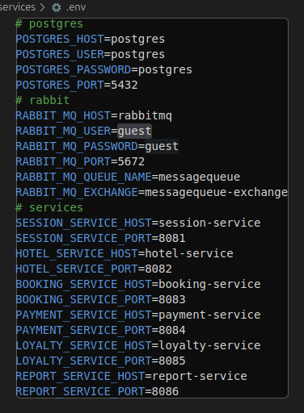

- Соберём для сервисов (скачаем для redis и postgres) образы и запустим приложения единой командой
```shell
docker compose --env-file .env up -d
```
- В выводе после этапа сборки отобразятся собранные образы, примонтированный том для данных БД, виртуальная сеть и запущенные контейнеры \
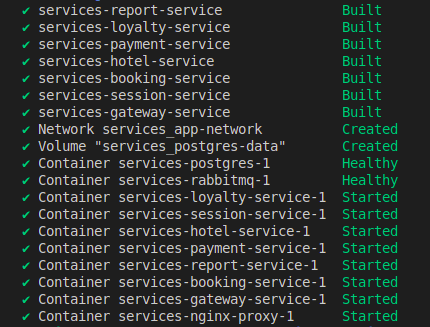

- Посмотрим размеры собранных образов
```shell
docker images
```
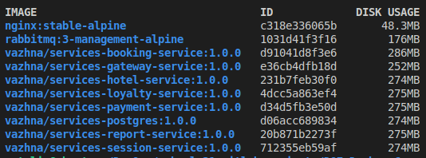

- Проверим, что все контейнеры запустились
```shell
docker ps
```
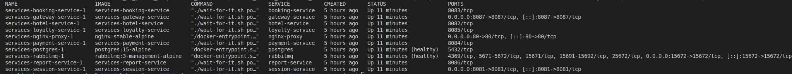

- Проверим запуск приложения в браузере \
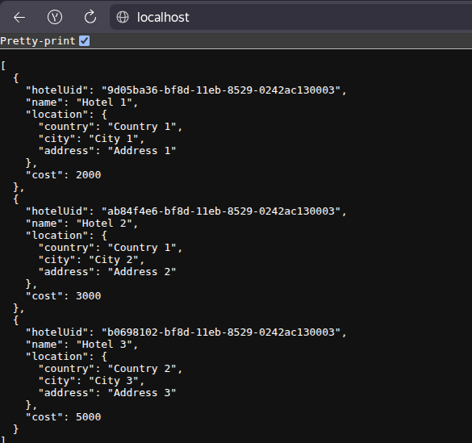 \
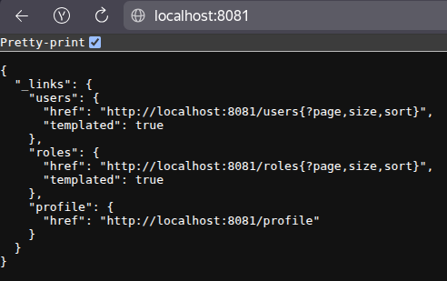

- Запустим автотесты и убедимся, что все они пройдены успешно \
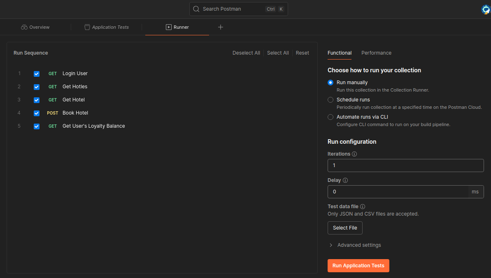 \
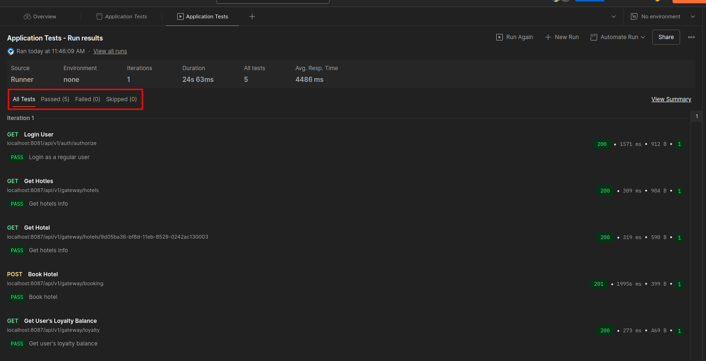

## Part 2. Создание виртуальных машин

- Установим `vagrant` и проверим версию.
```shell
sudo apt update && sudo apt install vagrant
vagrant --version
```
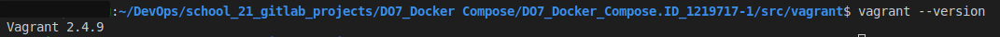

- Создадим рабочую директорию для **Vagrant** и с помощью команды `vagrant init` сгенерируем `Vagrantfile`, который содержит начальные инструкции к его написанию. В `Vagrantfile` создаются машины и прописываются их имена, операционные системы, shell-скрипты, которые будут выполняться при старте машин для установки необходимых инструментов и осуществлять инициализацию `docker swarm`.\
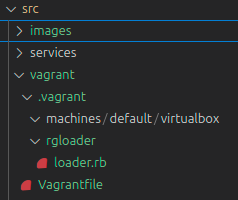

- Напишем `Vagrantfile` для одной виртуальной машины и перенесем исходный код веб-сервиса в рабочую директорию виртуальной машины.
```
Vagrant.configure("2") do |config|
  config.vm.box = "hashicorp-education/ubuntu-24-04"
  config.vm.box_version = "0.1.0"

  config.vm.synced_folder "../services", "/home/vagrant/"
end
```

- Запустим командой `vagrant up`.
```shell
vagrant up
```
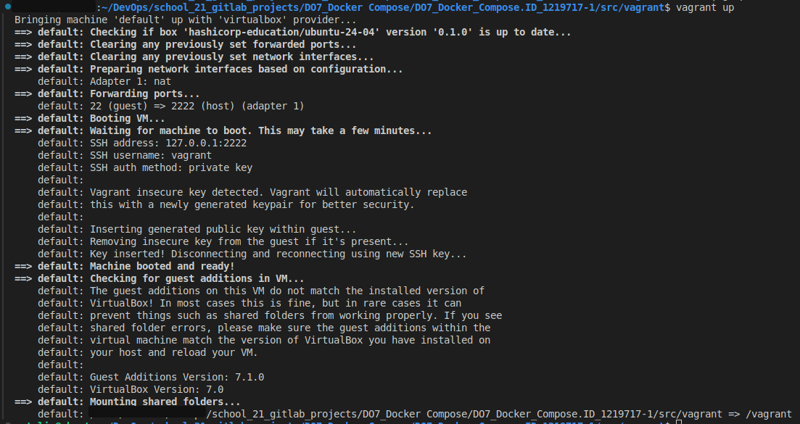
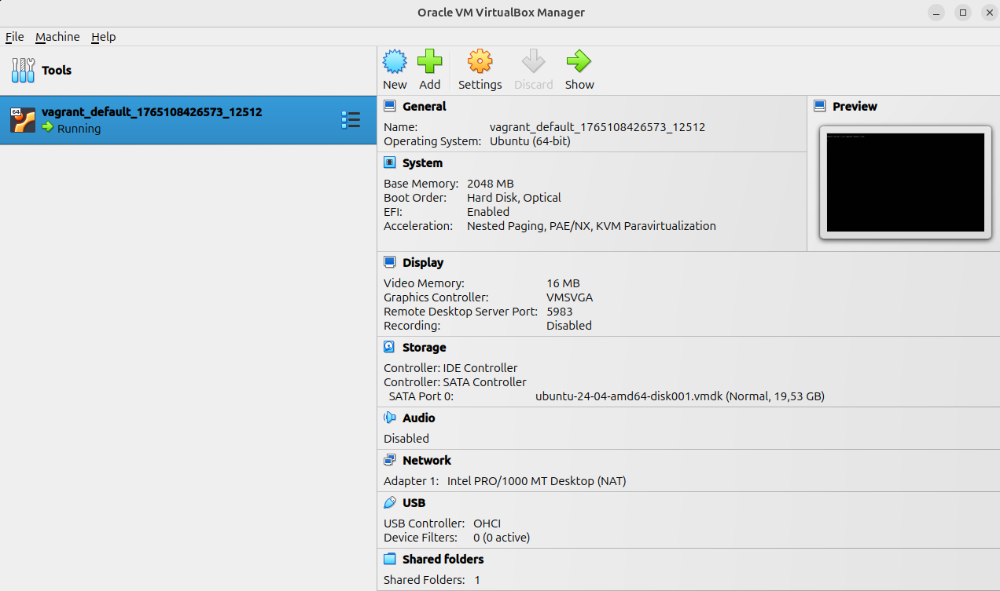

- Проверим статус машины командой `vagrant status`
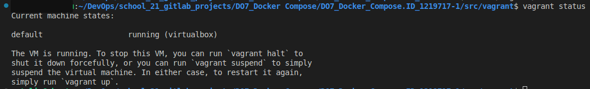

- Зайдем через консоль внутрь виртуальной машины `vagrant ssh` и удостоверимся, что исходный код встал в рабочую директорию `/home/vagrant/`.
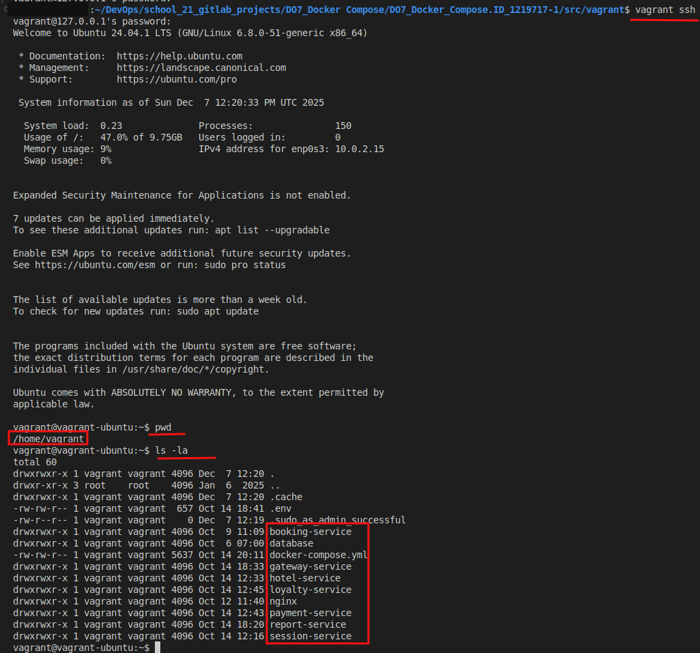

- Остановить ВМ можно командой `vagrant halt`. Уничтожим ВМ `vagrant destroy` и проверим состояние.
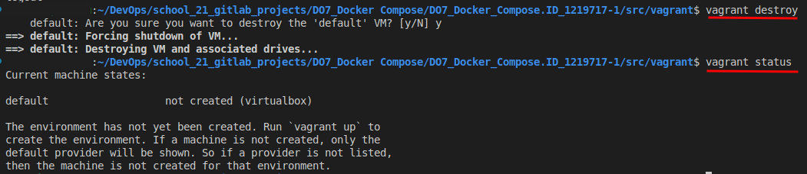

## Part 3. Создание простейшего Docker Swarm

- Модифицируем `Vagrantfile` для создания трех машин: `manager01`, `worker01`, `worker02`.

- Напишем shell-скрипты и разместим их в папке `scripts` для установки `Docker` внутрь машин, инициализации и подключения к `Docker Swarm`.

- Cоберём все образы и сразу запушим в репозиторий
```shell
docker compose build --push
```
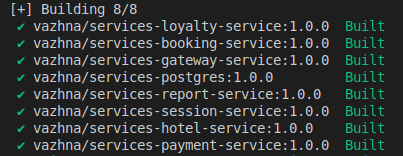 \
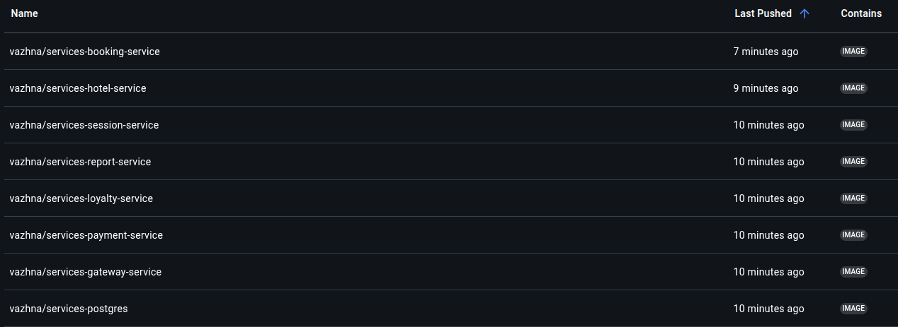

- Модифицируем `Docker Compose` файл в `docker-compose-swarm.yml` для подгрузки собранных образов, расположенных на `Docker Hub`.

- Отдельным стеком установим `Portainer` внутри кластера. Для этого напишем `portainer-agent-stack.yml` файл.

- Настроим прокси на базе `nginx` для доступа к `gateway service` и `session service` по оверлейной сети, где `gateway service` и `session service` недоступны напрямую.

- Запустим все ноды одной командой `vagrant up`
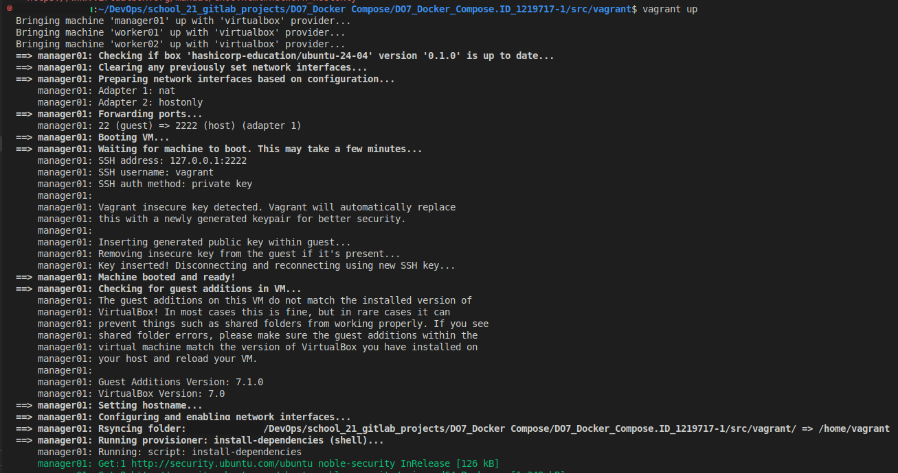\
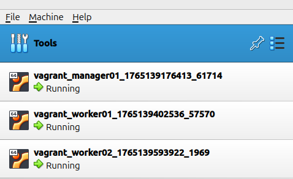

- В логах видим, что оба worker'а присоединились \
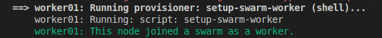 \
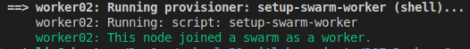

- Убедимся, что всё работает, проверим запущенные стеки
```shell
vagrant ssh manager01
docker node ls
```
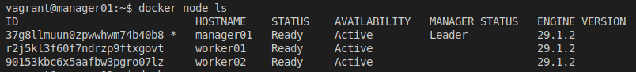
```
docker stack services hotel-app
```
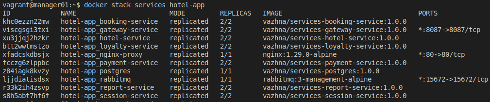
```
docker stack services portainer
```
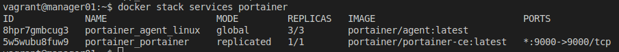

- Используя команды Docker, отобразим распределение контейнеров по узлам.
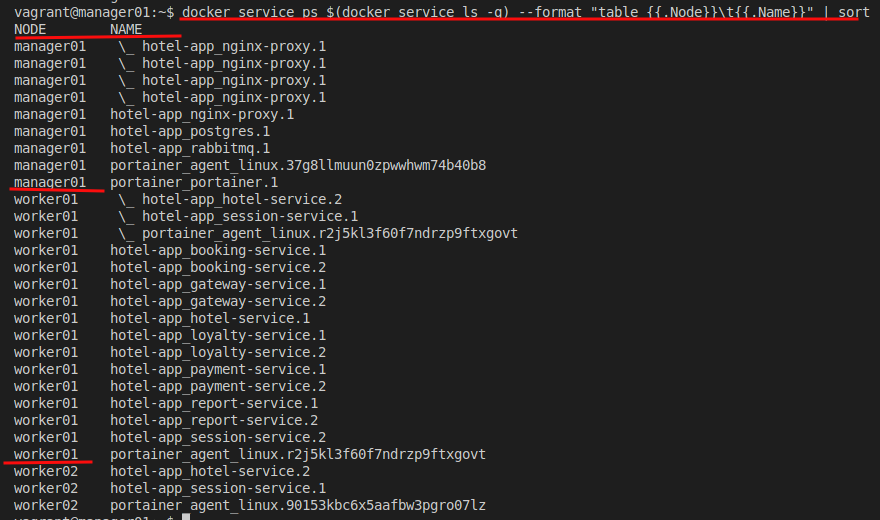

- Проверим визуализацию распределения задач по узлам с помощью Portainer
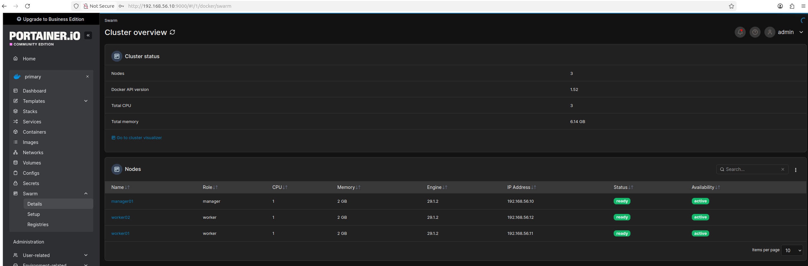 \
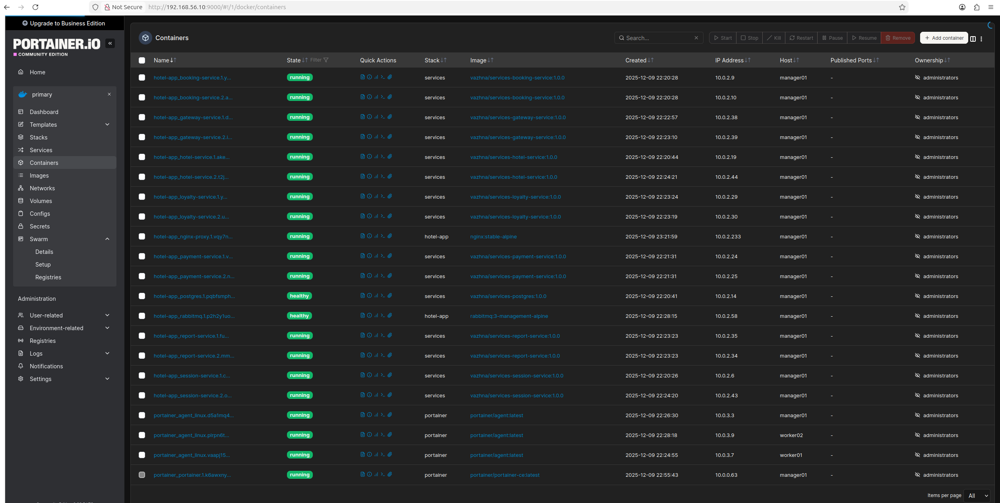 \
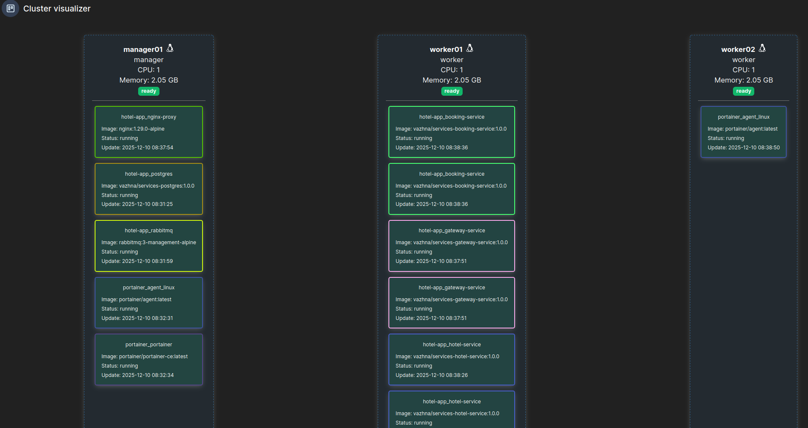

- Прогоним заготовленные тесты через Postman и удостоверимся, что все они проходят успешно
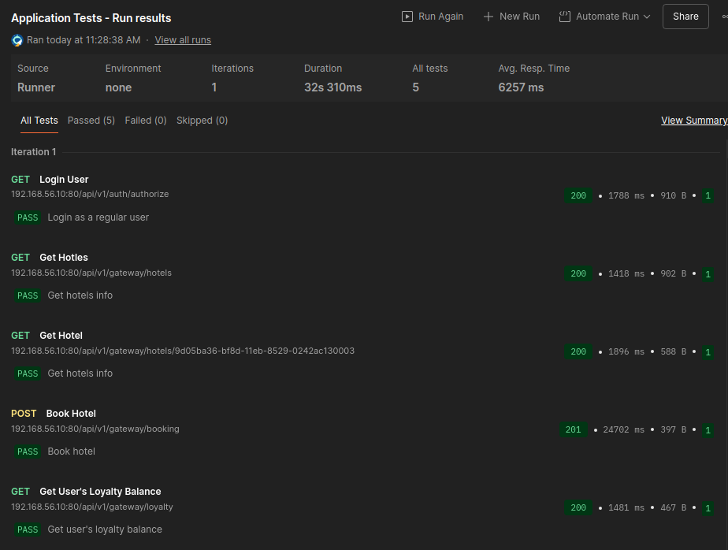

- Остановим и удалим все трейсы виртуальных машин
```shell
vagrant destroy -f
```
